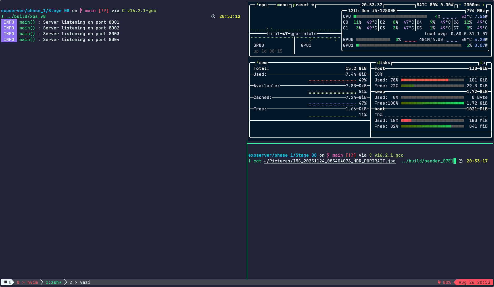
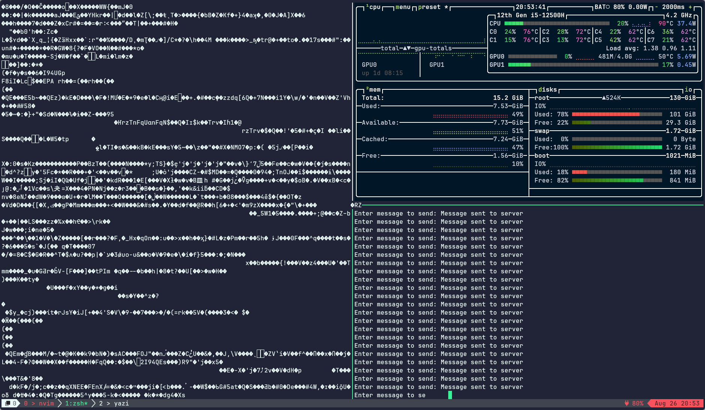
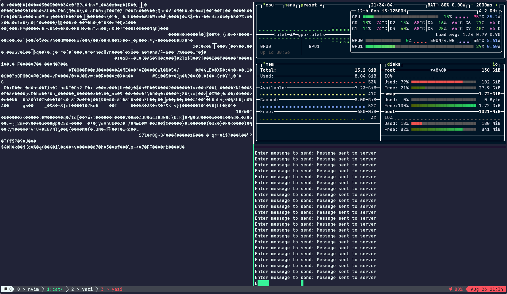
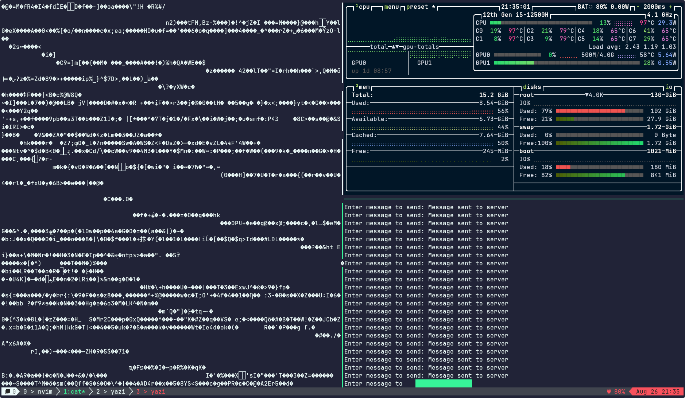

# Stage 8 : Experiment 2

Ran the program with btop in the side moniotring stats.
Removed the line which prints the client message from `connection_read_handler()` in xps_connection.c

- Started the server
  
- Using the sender program from stage 7 sent, a 1.5gb tar file
  No Sudden increase in memory usage initially
  
- After some time meory usage increased
  
- After some more time, memory usage reached 56% (Showed a total of 6% memory usage increase)
  

## Reasons

- As the sender utility from Stage 7 only sends data and does not recv them,
  when we try to send the reversed string back to the client it accumulates in the kernel buffer.
- Once the kernel buffer is full, the data will start buffering in the user space buffer ie. write_buff_list
- As there is no limit for the buffer size, the incoming data will keep on getting added to the buffer and
  will result in the steady growth of memory usage by the xps process.
