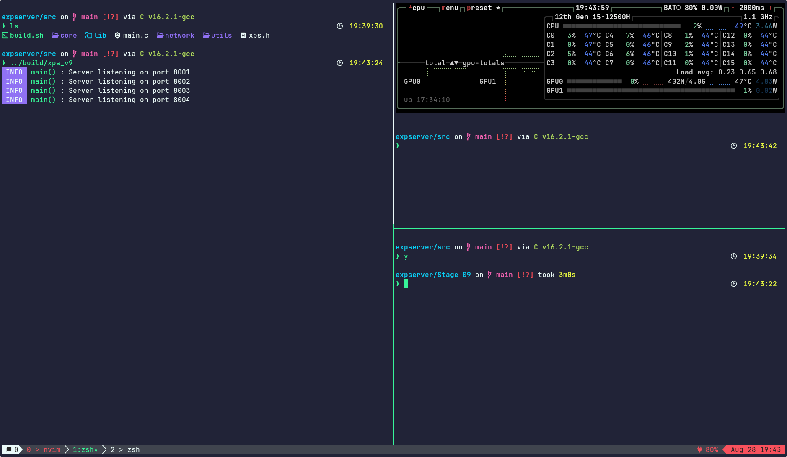
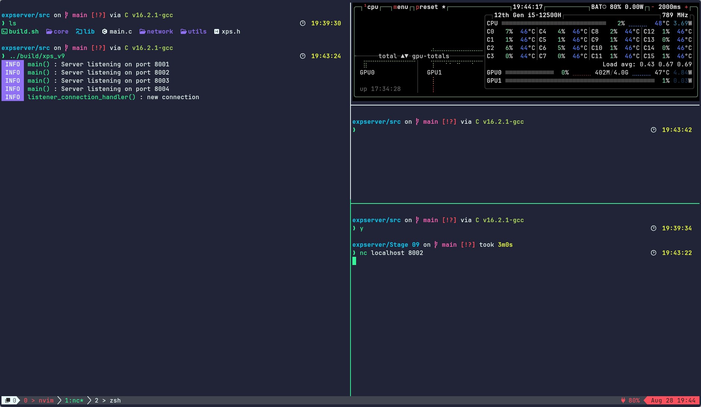
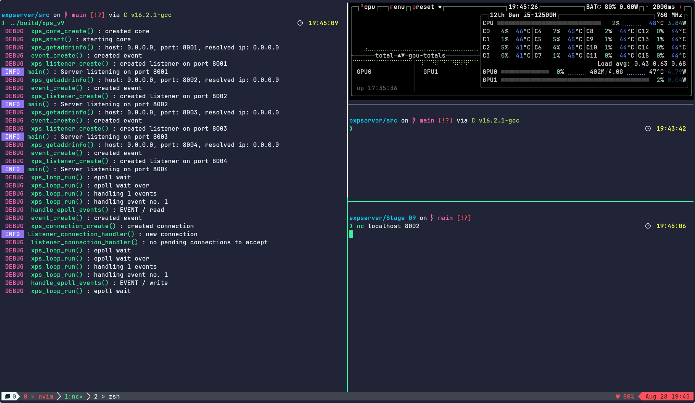

# Stage 9 : Experiment 1

Ran the program with btop in the side monitoring stats.

- Started the server
  
- Connected a client using netcat on port 8002
  There was no major increase in CPU usage like in Stage 08 experiment 01
  
- Connected a client using netcat on port 8002 in DEBUG mode
  Same effect on CPU utilisation without DEBUG mode, but considerably less utilization
  

## Reasons

- Since epoll is currently in edge triggered mode, it will only notify when there is a new change in the event.
  This reduced the CPU utilization during idle connection
