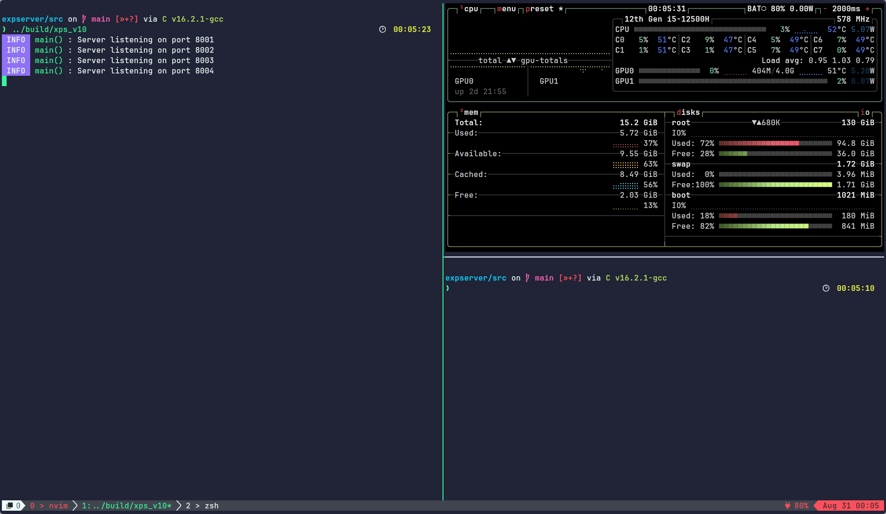
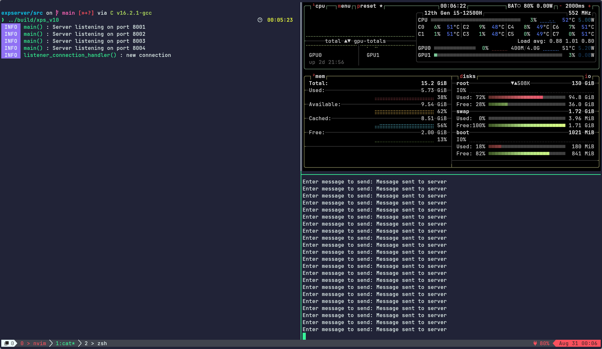
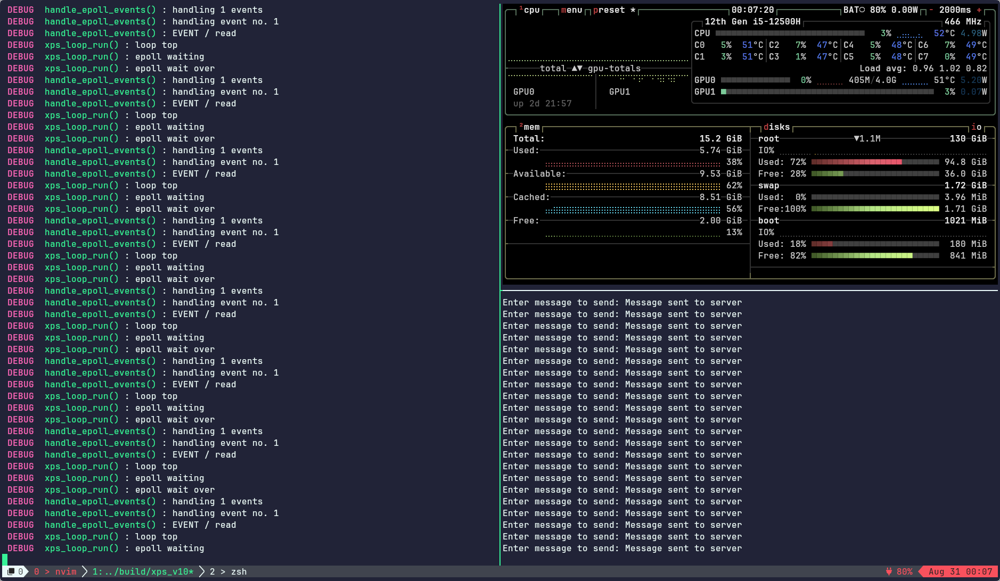

# Stage 10 : Experiment 1

Ran the program with btop in the side moniotring stats.
Removed the line which prints the client message from `connection_read_handler()` in xps_connection.c

- Started the server
  
- Using the sender program from stage 7 sent, a 1.5gb tar file
  In normal mode:
  
  in debug mode:
  

- The memory usage did not change from 37-38 % range.

## Reasons

- The data read is stored to pipe only if buffer size of the pipe < pipe buffer threshold
- Since data is only being recived, ad not sent back, bufffer size increases until >= pipe buffer threshold.
- After this point, source is not writable
