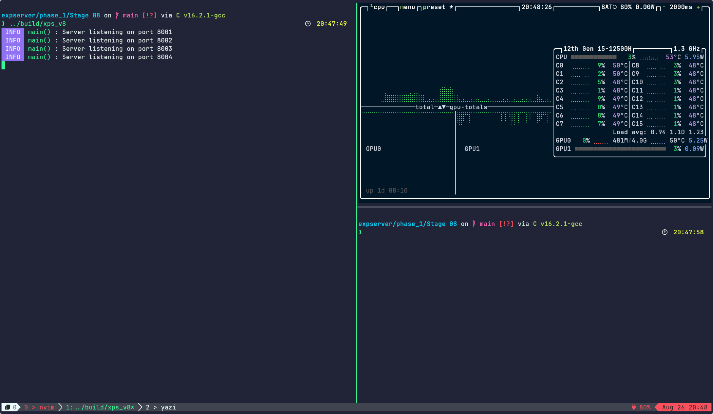
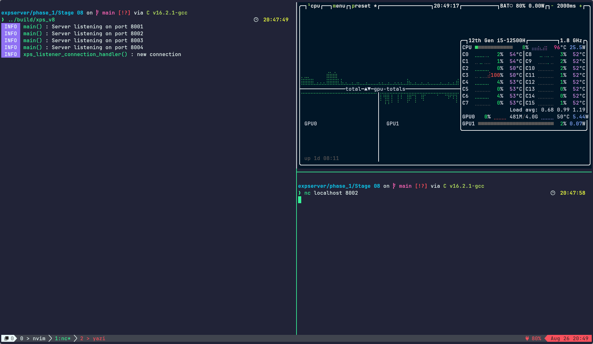
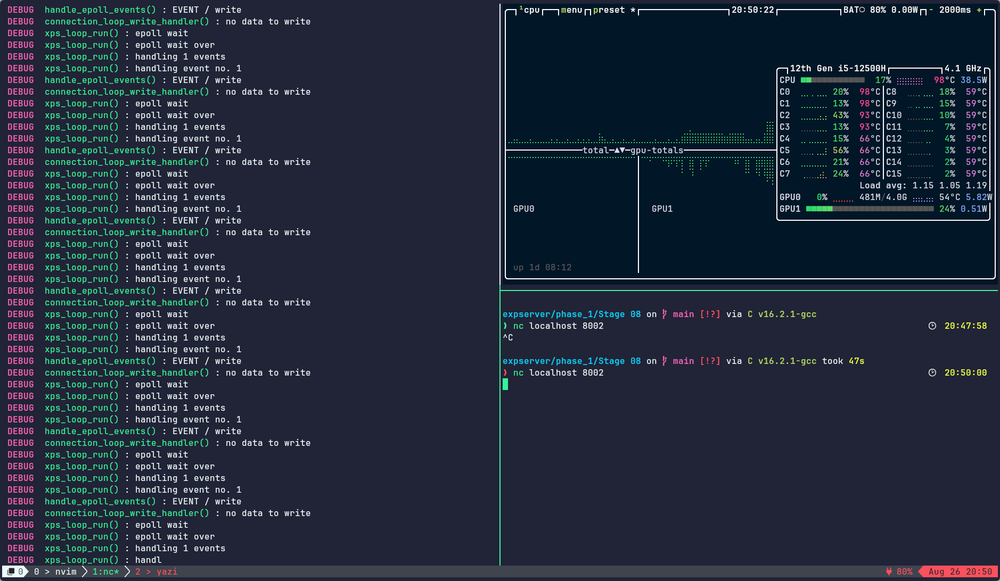

# Stage 8 : Experiment 1

Ran the program with btop in the side monitoring stats.

- Started the server
  
- Connected a client using netcat on port 8002
  Showed signs of increased CPU utilisation on all CPU cores, expecially C5, C6, and C7 (Upto 100% sometimes)
  
- Connected a client using netcat on port 8002 in DEBUG mode
  Same effect on CPU utilisation without DEBUG mode, but considerably less utilization
  

## Reasons

- Since epoll is currently in level triggered mode, its notifying all the time because the kernel buffer is free to write to.
  Since we have nothing to write when connection is idle, it will notify everytime.
- CPU utilisation is comparitively lesser because now the CPU takes some time for printing the DEBUG messages.
